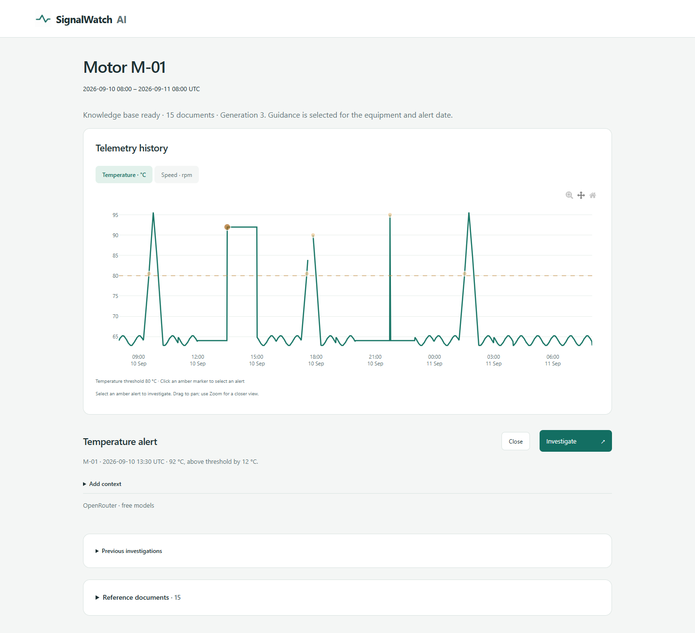
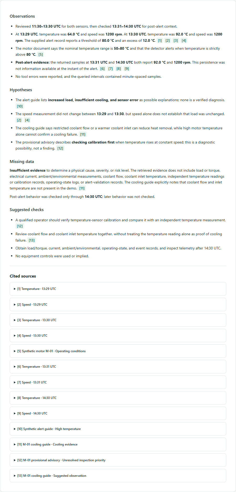

# SignalWatch AI

A local demo for investigating synthetic motor telemetry with a small Python agent. The app combines a Flask dashboard, PostgreSQL with pgvector, local document retrieval and an optional OpenRouter model. The original C# SignalWatch repository is separate.



## What the demo does

The dashboard contains a 24-hour synthetic history for motor M-01. Select an amber temperature alert, add context if useful, and ask the agent to investigate it.

The report separates:

- observations from the measurements;
- hypotheses that still need checking;
- missing data;
- suggested next checks;
- citations to the retrieved measurements and documents.



| Area | Current implementation |
| --- | --- |
| Telemetry | Five synthetic episodes, six temperature alerts and an explicit data gap |
| Retrieval | `all-MiniLM-L6-v2` embeddings, exact cosine search with pgvector, 15 curated documents and 26 passages |
| Agent tools | `read_measurements` and `search_documents`, both read-only and parameterized |
| Storage | PostgreSQL with evidence snapshots for saved reports |
| Model | A tool-capable free OpenRouter model, configured locally |

The model cannot run SQL, shell commands or equipment controls. Data is synthetic. Keep the repository private and use suitable public data only if you extend it.

## Quick start on Windows

You need Python 3.12, Docker Desktop running Linux containers and internet access for the first model download.

Create the environment and install the pinned dependencies:

```powershell
python -m venv .venv
.\.venv\Scripts\python.exe -m pip install -r requirements.lock
.\.venv\Scripts\python.exe -m pip install -e .
Copy-Item .env.example .env
```

Edit `.env` and set:

- `SIGNALWATCH_DB_PASSWORD`;
- the same password in `DATABASE_URL`;
- `OPENROUTER_API_KEY`, or a specific tool-capable model ending in `:free`.

Keep `.env` private. Credentials stay on the server, and existing environment variables take precedence.

For a fresh demo, run:

```powershell
docker compose up -d --wait
.\.venv\Scripts\signalwatch-db.exe init
.\.venv\Scripts\signalwatch-db.exe seed
.\.venv\Scripts\signalwatch-db.exe encoder-setup
.\.venv\Scripts\signalwatch-db.exe prepare
.\.venv\Scripts\signalwatch.exe
```

Open [http://127.0.0.1:5055](http://127.0.0.1:5055). Use `--port 5056` to choose another port. The app binds to loopback, and PostgreSQL is exposed only on `127.0.0.1:55432`.

`encoder-setup` downloads the pinned encoder once. `prepare` validates the document catalog, computes embeddings and publishes a corpus generation. Stop the app before running `prepare` or a migration. If the documents change, new investigations stay blocked until preparation succeeds.

## How to use it

1. Click an amber marker in the temperature chart.
2. Add optional context, such as a time window to review.
3. Click **Investigate**.
4. Follow the citations in the report. They open the matching measurement or document snapshot.

The graph also includes speed, pan and zoom controls. Previous investigations reopen without another model call and keep their original evidence. The reference-document panel supports a bounded search over the prepared corpus.

## Evidence boundary

The Python application owns threshold checks, argument validation, retrieval filters and data-derived numbers. A temperature alert requires a value strictly above 80 °C. A missing minute breaks continuity. There are no configured speed or missing-data alarms.

The agent receives the actual dataset range and can call only these tools:

- `read_measurements(sensor, start, end)`;
- `search_documents(query)`.

The catalog filters guidance by equipment and alert time. A report must cite every available source category. A successful empty search is reported as `Insufficient evidence`; database or provider errors stop the investigation. Valid citations prove provenance and retrieval, not that a physical diagnosis is correct.

## Evaluation

Retrieval evaluation uses the local encoder and PostgreSQL without calling a generation API. The 40 labelled synthetic queries contain 30 development cases and 10 held-out cases.

```powershell
.\.venv\Scripts\signalwatch-db.exe evaluate retrieval --split development
.\.venv\Scripts\signalwatch-db.exe evaluate retrieval --split held_out
```

For live report evaluation, select one specific tool-capable `:free` model in `.env`:

```powershell
.\.venv\Scripts\signalwatch-db.exe evaluate reports --mode semantic --live
```

Use `--attempts 3` for repeated trials when the provider is available. Results, traces and exports are stored under `reports/local/`, which is intentionally ignored by Git. The automated run checks completion, failures, tool traces, retrieved evidence and citation structure. It does not score the semantic quality of the diagnosis. See [`docs/validation.md`](docs/validation.md) for the limits and the optional review format.

## Verification

Tests need PostgreSQL, a prepared encoder and a test connection string whose database name ends in `_test`. They create disposable databases and never call a generation API.

```powershell
.\.venv\Scripts\python.exe -m unittest discover -s tests -v
node --check src/signalwatch_ai/static/app.js
.\.venv\Scripts\python.exe -m black --check src tests
```

Browser checks use Playwright with intercepted model responses. With Edge installed:

```powershell
$env:SIGNALWATCH_TEST_BROWSER = "msedge"
.\.venv\Scripts\python.exe tests/browser_smoke.py
```

## More detail

<details>
<summary>Migrate the previous SQLite demo</summary>

Stop the old app first. Migration reads the source files without changing them and creates consistent backups in `data/local/migration-backups/`.

```powershell
.\.venv\Scripts\signalwatch-db.exe migrate PATH_TO_OLD_DATA/demo.sqlite3 --dataset demo
.\.venv\Scripts\signalwatch-db.exe migrate PATH_TO_OLD_DATA/demo-timeline.sqlite3 --dataset timeline
.\.venv\Scripts\signalwatch-db.exe migrate PATH_TO_OLD_DATA/demo-investigations.sqlite3
```

Repeat the command for any other legacy dataset, using its matching `--dataset` value. The importer verifies values, timestamps, gaps, alerts and report payloads before committing. Identical imports are safe to repeat. Conflicting readings or report IDs fail without overwriting existing records. PostgreSQL is the only active database after migration.

</details>
<details>
<summary>Back up and restore PostgreSQL</summary>

Create a custom-format backup inside the container and copy it out without PowerShell text redirection:

```powershell
docker compose exec -T postgres pg_dump -U signalwatch -d signalwatch -Fc -f /tmp/signalwatch.dump
docker compose cp postgres:/tmp/signalwatch.dump data/local/signalwatch.dump
```

Restore into a new database before relying on the backup:

```powershell
docker compose exec -T postgres createdb -U signalwatch signalwatch_restore_check
docker compose exec -T postgres pg_restore -U signalwatch -d signalwatch_restore_check --exit-on-error /tmp/signalwatch.dump
```

Keep the source documents and encoder files that match the backup. `docker compose restart postgres` preserves the named volume. Do not use `docker compose down -v` on data you want to keep.

</details>

<details>
<summary>Repository map and scope</summary>

- `telemetry.py`: synthetic data, measurements and thresholds.
- `database.py`, `schema.sql`: PostgreSQL connection and schema.
- `migration.py`: explicit SQLite import and verification.
- `encoder.py`, `knowledge.py`: local encoding, catalog validation and retrieval.
- `evidence.py`, `presentation.py`: citations and safe Markdown rendering.
- `agent.py`: OpenRouter transport, tool loop and reference checks.
- `history.py`: saved investigation snapshots.
- `evaluation.py`, `commands.py`: evaluation, review and setup commands.
- `web.py`, `templates/`, `static/`: browser application.

There is no ORM, separate vector server, paid service or frontend build step. The supported knowledge-base format is curated English Markdown, not arbitrary PDF/OCR input. Plotly.js is bundled locally under its MIT license.

</details>
