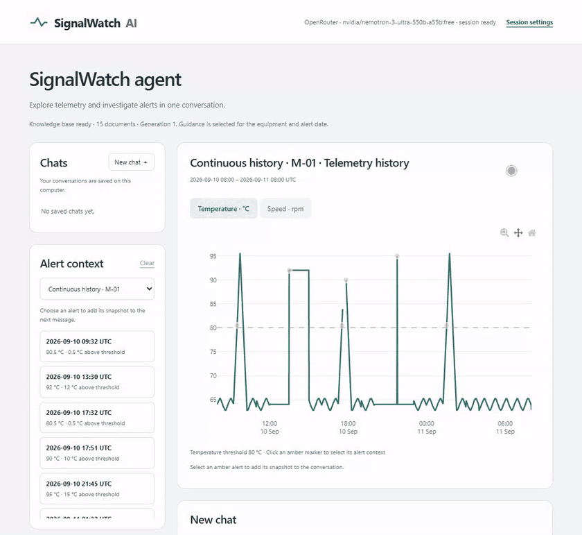
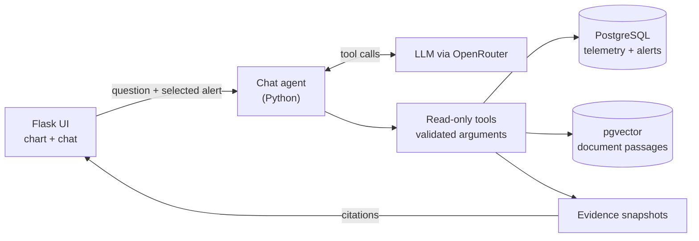

# SignalWatch AI

A read-only AI agent that investigates industrial telemetry alerts and answers with citations to the exact measurements and documents it used.



<sub>Real run with a free OpenRouter model (`nvidia/nemotron-3-ultra-550b-a55b:free`); the waiting time while the agent calls its tools is sped up.</sub>

## Why

An LLM answer about sensor data is only useful if an engineer can check it. SignalWatch AI keeps the model away from the database and from the numbers that matter:

- the model can only call a small set of **read-only tools** with validated arguments;
- thresholds, alerts and every data-derived number come from **Python code**, not from the model;
- every claim in an answer must **cite evidence retrieved in the same conversation**, and clicking a citation opens the saved snapshot of that evidence.

All telemetry and documents are synthetic. The .NET telemetry API that inspired this project lives in [SignalWatch](https://github.com/alemoscardo/SignalWatch).

## What it does

- **Alert-aware chat:** pick an amber temperature alert on the chart and ask about it, or ask questions across all six datasets.
- **Live tool trace:** the chat streams each model request and tool call, including the arguments and results.
- **Retrieval over guidance documents:** 15 curated documents (26 passages) embedded locally with `all-MiniLM-L6-v2` and searched with pgvector, filtered by equipment and alert date.
- **Structured, cited answers:** observations, hypotheses, missing data and suggested checks, with numbered sources.
- **Persistent conversations:** chats, tool traces and evidence snapshots are stored in PostgreSQL and reopen without another model call; long chats are compacted in place.
- **Any tool-capable model:** configured through OpenRouter, in `.env` or for the current browser session.

## How it works


```mermaid
flowchart LR
    UI["Flask UI<br/>chart + chat"] -->|question + selected alert| Agent["Chat agent<br/>(Python)"]
    Agent <-->|tool calls| LLM["LLM via OpenRouter"]
    Agent --> Tools["Read-only tools<br/>validated arguments"]
    Tools --> TS[("PostgreSQL<br/>telemetry + alerts")]
    Tools --> KB[("pgvector<br/>document passages")]
    Tools --> EV["Evidence snapshots"]
    EV -->|citations| UI
```

The agent can call only these tools:

| Tool | Purpose |
| --- | --- |
| `list_datasets()`, `list_alerts(dataset)` | Discover the available telemetry and alerts |
| `read_measurements(dataset, sensor, start, end)` | Bounded reads of temperature or speed; oversized windows are rejected |
| `search_documents(query, dataset, at)` | Semantic search over guidance valid for that equipment and date |
| `open_saved_evidence(reference)` | Re-open a snapshot already retrieved in the same chat |

The model cannot run SQL, shell commands or equipment controls. A temperature alert requires a value strictly above 80 °C, and a missing minute breaks continuity; there are no speed or missing-data alarms. An empty search is reported as insufficient evidence, and provider or database errors are kept on the turn. Valid citations prove where a statement came from, not that a physical diagnosis is correct.

## Tech stack

| Area | Tools |
| --- | --- |
| Backend | Python 3.12, Flask, psycopg 3 |
| Storage and retrieval | PostgreSQL 17 with pgvector 0.8 (Docker Compose), sentence-transformers |
| Model access | OpenRouter chat completions with tool calling and streaming |
| Frontend | Server-rendered HTML, vanilla JavaScript, Plotly.js (bundled) |
| Quality | `unittest` (74 tests), Playwright browser checks, Black |

There is no ORM, separate vector server, paid service or frontend build step.

## Quick start (Windows)

You need Python 3.12, Docker Desktop running Linux containers, an [OpenRouter](https://openrouter.ai/) API key and internet access for the first encoder download.

```powershell
python -m venv .venv
.\.venv\Scripts\python.exe -m pip install -r requirements.lock
.\.venv\Scripts\python.exe -m pip install -e .
Copy-Item .env.example .env
```

In `.env`, set `SIGNALWATCH_DB_PASSWORD`, the same password in `DATABASE_URL`, `OPENROUTER_API_KEY` and a tool-capable `OPENROUTER_MODEL`. The key and model can also be entered in the browser for the current session. Keep `.env` private; credentials stay on the server.

Start the database, load the demo data and run the app:

```powershell
docker compose up -d --wait
.\.venv\Scripts\signalwatch-db.exe init
.\.venv\Scripts\signalwatch-db.exe seed
.\.venv\Scripts\signalwatch-db.exe encoder-setup
.\.venv\Scripts\signalwatch-db.exe prepare
.\.venv\Scripts\signalwatch.exe
```

Open <http://127.0.0.1:5055> (`--port 5056` chooses another port). The app binds to loopback, and PostgreSQL is exposed only on `127.0.0.1:55432`.

`encoder-setup` downloads the pinned encoder once. `prepare` validates the document catalog, computes embeddings and publishes a corpus generation; stop the app before running it. If the documents change, new investigations stay blocked until preparation succeeds. `init` also upgrades an existing schema v1 database without touching telemetry or archived reports.

## Using it

1. Choose a dataset and, optionally, click one of its amber temperature alerts.
2. Start a new chat or reopen a saved one.
3. Ask about the selected alert, compare datasets or request a specific time window. The selected alert applies to later messages in that conversation.
4. Open **Tool Calls** to see what the agent checked, and follow the numbered citations to the evidence.

The chart supports speed, pan and zoom. Reports from the earlier one-shot investigation workflow remain in a separate archive, and the reference-document panel supports a bounded search over the prepared corpus.

## Evaluation

Retrieval is evaluated with the local encoder and PostgreSQL, without calling a generation API, on 40 labelled synthetic queries (30 development, 10 held out):

```powershell
.\.venv\Scripts\signalwatch-db.exe evaluate retrieval --split development
.\.venv\Scripts\signalwatch-db.exe evaluate retrieval --split held_out
```

Live report evaluation runs the agent against one chosen model (`--attempts 3` repeats each case):

```powershell
.\.venv\Scripts\signalwatch-db.exe evaluate reports --mode semantic --live
```

The automated run checks completion, failures, tool traces, retrieved evidence and citation structure. It does not score whether a diagnosis is right. Results are written to `reports/local/` (ignored by Git); see [`docs/validation.md`](docs/validation.md) for the limits and the review format. This is a small synthetic benchmark, not a measure of real-world accuracy.

## Tests

Tests need PostgreSQL, a prepared encoder and a test connection string whose database name ends in `_test`. They create disposable databases and never call a generation API.

```powershell
.\.venv\Scripts\python.exe -m unittest discover -s tests -v
node --check src/signalwatch_ai/static/app.js
.\.venv\Scripts\python.exe -m black --check src tests
```

Browser checks use Playwright with intercepted model responses. With Edge installed:

```powershell
$env:SIGNALWATCH_TEST_BROWSER = "msedge"
.\.venv\Scripts\python.exe tests/browser_smoke.py
```

## Limitations

- Telemetry, alerts and documents are synthetic, for one motor (M-01).
- The knowledge base accepts curated English Markdown, not arbitrary PDFs or OCR.
- Free OpenRouter models change often and some are slow; answers vary between runs and models.
- Citations show provenance, not correctness; the diagnosis still needs a qualified person.

## More detail

<details>
<summary>Migrate the previous SQLite demo</summary>

Stop the old app first. Migration reads the source files without changing them and creates consistent backups in `data/local/migration-backups/`.

```powershell
.\.venv\Scripts\signalwatch-db.exe migrate PATH_TO_OLD_DATA/demo.sqlite3 --dataset demo
.\.venv\Scripts\signalwatch-db.exe migrate PATH_TO_OLD_DATA/demo-timeline.sqlite3 --dataset timeline
.\.venv\Scripts\signalwatch-db.exe migrate PATH_TO_OLD_DATA/demo-investigations.sqlite3
```

Repeat the command for any other legacy dataset, using its matching `--dataset` value. The importer verifies values, timestamps, gaps, alerts and report payloads before committing. Identical imports are safe to repeat. Conflicting readings or report IDs fail without overwriting existing records. PostgreSQL is the only active database after migration.

</details>
<details>
<summary>Back up and restore PostgreSQL</summary>

Create a custom-format backup inside the container and copy it out without PowerShell text redirection:

```powershell
docker compose exec -T postgres pg_dump -U signalwatch -d signalwatch -Fc -f /tmp/signalwatch.dump
docker compose cp postgres:/tmp/signalwatch.dump data/local/signalwatch.dump
```

Restore into a new database before relying on the backup:

```powershell
docker compose exec -T postgres createdb -U signalwatch signalwatch_restore_check
docker compose exec -T postgres pg_restore -U signalwatch -d signalwatch_restore_check --exit-on-error /tmp/signalwatch.dump
```

Keep the source documents and encoder files that match the backup. `docker compose restart postgres` preserves the named volume. Do not use `docker compose down -v` on data you want to keep.

</details>

<details>
<summary>Repository map and scope</summary>

- `telemetry.py`: synthetic data, measurements and thresholds.
- `database.py`, `schema.sql`: PostgreSQL connection and schema.
- `migration.py`: explicit SQLite import and verification.
- `encoder.py`, `knowledge.py`: local encoding, catalog validation and retrieval.
- `evidence.py`, `presentation.py`: citations and safe Markdown rendering.
- `agent.py`: OpenRouter transport and the archived investigation workflow.
- `chat_agent.py`, `chat_store.py`: streaming read-only agent, persistent threads, evidence snapshots and context compaction.
- `chat_presentation.py`: safe chat Markdown and evidence citation rendering.
- `history.py`: saved investigation snapshots.
- `evaluation.py`, `commands.py`: evaluation, review and setup commands.
- `web.py`, `templates/`, `static/`: browser application.

There is no ORM, separate vector server, paid service or frontend build step. The supported knowledge-base format is curated English Markdown, not arbitrary PDF/OCR input. Plotly.js is bundled locally under its MIT license.

</details>
